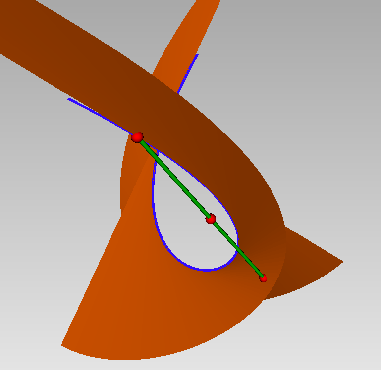

# Generalized Additive Decomposition

The Generalized Additive Decomposition of a symmetric tensor $F$ of degree $d$ is a decomposition of the form 

```math
 F = \sum_{i=1}^{r} \omega_i L_i^{d-k_i}
```
where $\omega_i$ is a symmetric tensor of order $k_{i}$  and $L_i$ is a linear form (of degree $1$).

The function `TensorDec.gad_decompose` computes such a decomposition when the regularity of the associated apolar ideal is smaller than $d/2$ (see [`gad_decompose`](@ref)).

This decomposition consists in writing the form $F$ as a linear combination of points on the osculating varieties to the Veronese variety.

For instance, $F = \frac 1 2\,(x+y+z)^5 + \frac 3 {10} (x-z)^4 \, (x+y)$ is a combination of a point $(x+y+z)^5$ on the Veronese variety (Osculating variety of order $0$) and a point $(x+y)\, (x-z)^4$ on the tangential variety of the Veronese variety (Osculating variety of Order $1$) as illustrated here:



The blue curve represents the Veronsese variety and the orange surface represents the Tangential variety.

## How does it works ?

We illustrate the algorithm on the following example:
```@example gad1
using LinearAlgebra, DynamicPolynomials, AlgebraicSolvers, TensorDec

X = @polyvar x y z
F = 0.5*(x+y+z)^5 + 0.3*(x+y)*(x-z)^4 
```

We first compute the apolar series associated to $F$:
```@example gad1
sigma = apolar_dual(F)
```

We deduce the operators of multiplications $M$ by the variables using the Hankel or Catalecticant matrices, and computes the Schur joint factorization of $M$. This gives the points `Xi`, which are the coefficients of the linear forms $L_i$ of the GAD:
```@example gad1
M = AlgebraicSolvers.mult_matrices(sigma)
Xi, ms, Z, Tr = AlgebraicSolvers.schur_dcp(M, 1.e-3)
L = real.([dot(X,Xi[:,j]) for j in 1:size(Xi,2)])
```
These forms are proportional (up to machine precision) to $x+y+z$ and $x-z$.
The sum of the multiplicities 
```@example gad1
mu = length.(ms)
```
gives the GAD rank
```@example gad1
sum(mu)
```

To recover the weights $\omega_i$, we compute the operators of multiplication by the variables in the local Artinian algebras associated to the points $L_i$, compute their nil-indices and deduce the degrees of the $\omega_i$: 
```@example gad1
LocM = local_mult_matrices(Tr, ms)
nilx = nil_index(LocM, Xi)
dg = [nilx[i]-1 for i in 1:size(Xi,2)]
```
That is, the first weight $\omega_1$ is a constant, corresponding to the point on the Veronese variety,
and the second weight $\omega_2$ is a linear form, corresponding to a point on the Tangential variety.

Finally we solve a Vandermonde-like system to find the coefficients of the weights $\omega_i$, knowing their degrees:
```@example gad1
d = maxdegree(F); nPt = size(Xi,2)                           # hide
D = DynamicPolynomials.monomials(X,d)                        # hide
mlt = [DynamicPolynomials.monomials(X,dg[i]) for i in 1:nPt] # hide
P = vcat([L[i]^(d-dg[i])*mlt[i] for i in 1:nPt]...)          # hide
Vdm = AlgebraicSolvers.matrixof(P,D)'                        # hide
b   = AlgebraicSolvers.matrixof([F],D)'                      # hide
ws = Vdm\b                                                   # hide
W = []; s = 0                                                # hide
for i in 1:nPt                                               # hide
    l = length(mlt[i])                                       # hide
    w = dot(mlt[i], ws[s+1:s+l])                             # hide
    push!(W, dot(mlt[i], ws[s+1:s+l]))                       # hide
    global s+=l                                              # hide
end                                                          # hide
real.(W)                                                     # hide
```
The weight of degree $1$ is proportional (up to machine precision) to $x+y$.
